# ServidorWebMantenible

ServidorWebMantenible evoluciona un servidor HTTP básico (construido en un 
taller anterior de redes) hacia un pequeño servidor de aplicaciones, un mini
framework web que separa la infraestructura HTTP del comportamiento de la 
aplicación. En vez de escribir rutas dinámicas directamente dentro del ciclo de
conexiones del servidor (con if/else que crecen sin control), los desarrolladores 
registran rutas mediante lambdas y el servidor permanece secuencial, no hay hilos
ni concurrencia pero sí es extensible: agregar una ruta nueva no requiere 
tocar el código del servidor HTTP.

| Clase | Responsabilidad |
|---|---|
| Application | Punto de entrada de la aplicación de ejemplo. Registra las rutas disponibles y arranca el servidor. |
| ServidorWebMantenible | Fachada pública del framework. Expone get(), start(), stop(), isRunning(). Delega el trabajo real a Router y HttpServer. |
| Router | Mantiene el mapa de rutas registradas y ejecuta la lambda correspondiente cuando se invoca una ruta. |
| WebService | Interfaz funcional que representa una lambda manejadora: String call(Request req, Response resp). |
| HttpServer | Abre el ServerSocket, acepta conexiones, parsea la petición HTTP (método, ruta, query string), y construye la respuesta HTTP cruda. |
| Request | Abstracción de los datos de entrada de una petición; expone getValue(key) para leer parámetros del query string. |
| Response | Abstracción de la respuesta que una lambda puede construir (código de estado, tipo de contenido). |
| StaticFileService | Sirve archivos estáticos (HTML, CSS, JS, imágenes) desde webroot, con protección contra path traversal. |

#### Metáfora de arquitectura: un hospital

| Metáfora del hospital | Componente del framework |
|---|---|
| Recepción del hospital | HttpServer: recibe a cada paciente (conexión) que llega y su solicitud |
| Triage / módulo de admisiones | Router: determina a qué consultorio debe dirigirse cada paciente según su motivo de consulta |
| Consultorios especializados | Lambdas registradas con get(): cada una atiende un servicio específico (/hello, /pi, /e, /square) |
| Formulario de ingreso / receta médica que se lleva el paciente | Request / Response: lo que el paciente trae al llegar y lo que se lleva al salir |
| Archivo de historias clínicas | StaticFileService: entrega documentos ya existentes (HTML, CSS, JS, imágenes) sin necesidad de "abrir un consultorio" para cada uno |
| Reglamento del hospital (dirección, horario de atención) | Variables de entorno: PORT, APP_ENV, GREETING_PREFIX |
| Protocolo de cierre de turno | Apagado controlado (/shutdown): el hospital termina de atender al paciente actual antes de cerrar sus puertas |

Un médico que quiere ofrecer un nuevo servicio no necesita rediseñar la
recepción ni el módulo de triage del hospital, simplemente abre un consultorio
nuevo (get("/nueva-ruta", ...)), y el hospital (el servidor) sigue funcionando
exactamente igual para todos los demás pacientes.

#### Instrucciones para compilar y ejecutar localmente

**Requisitos previos**

- JDK 21
- Maven

**Compilar**

mvn clean package

Esto genera el ejecutable en target/ServidorWebMantenible-1.0-SNAPSHOT.jar.

**Ejecutar**

java -jar target/ServidorWebMantenible-1.0-SNAPSHOT.jar

Por defecto, el servidor arranca en el puerto 8080:

Ready to receive on port 8080...

**Probar en el navegador**

http://localhost:8080/
http://localhost:8080/pi
http://localhost:8080/hello?name=Pedro

#### Variables de entorno configuradas y su propósito

| Variable | Propósito | Valor por defecto (local) |
|---|---|---|
| PORT | Puerto en el que escucha el servidor HTTP | 8080 |
| GREETING_PREFIX | Prefijo usado por la ruta /hello al saludar | Hello |
| APP_ENV | Entorno de ejecución. Si es development, habilita la ruta /shutdown; en cualquier otro valor, esa ruta no se registra | development |

**Ejemplo: cambiar el puerto y el saludo en local**

PowerShell:

$env:PORT="3000"
$env:GREETING_PREFIX="Hola"
java -jar target/ServidorWebMantenible-1.0-SNAPSHOT.jar

#### Instrucciones para desplegar o reproducir el despliegue en la nube.

1. Asegúrate de tener un Dockerfile en la raíz del repositorio.
2. En render.com, crea una cuenta (con GitHub es lo más simple).
3. New +,  Web Service, conecta el repositorio de GitHub.
4. Render detecta el Dockerfile automáticamente.
5. Agrega las variables de entorno:

| Key | Value |
|---|---|
| APP_ENV | production |
| GREETING_PREFIX | Ciao |

7. Clic en Deploy web service. Cada push a la rama main dispara un nuevo 
despliegue automático.

#### La plataforma en la nube utilizada

Render, desplegado mediante Docker con build de dos etapas: compila con
Maven y empaqueta con un JRE 21 liviano.

#### La URL pública del despliegue.

https://servidorwebmantenible.onrender.com

#### URLs de ejemplo para recursos estáticos y endpoints REST

https://servidorwebmantenible.onrender.com/
https://servidorwebmantenible.onrender.com/pi
https://servidorwebmantenible.onrender.com/e
https://servidorwebmantenible.onrender.com/hello?name=Pedro
https://servidorwebmantenible.onrender.com/square?value=4
https://servidorwebmantenible.onrender.com/shutdown

#### 11. Evidencia de que la aplicación funciona
 
##### En local
 
**Recursos estáticos**
 
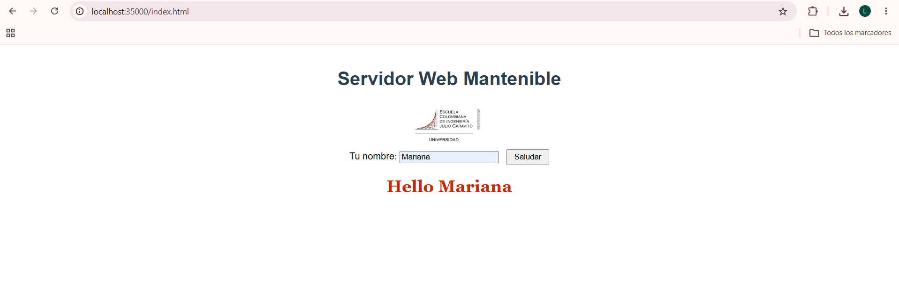
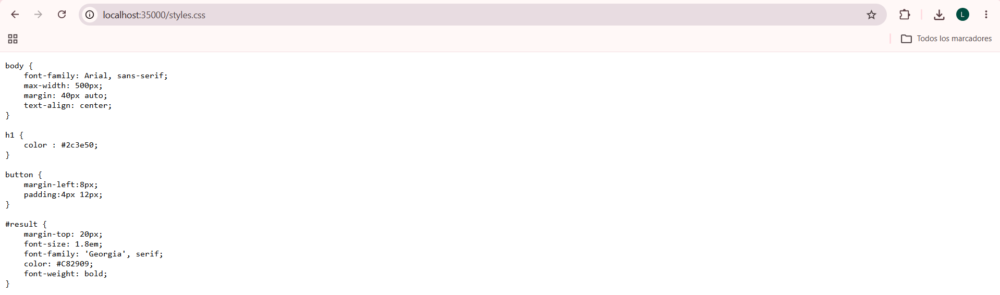
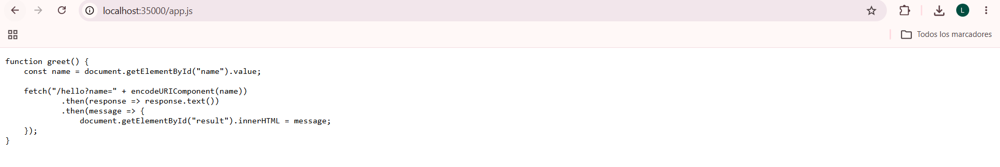
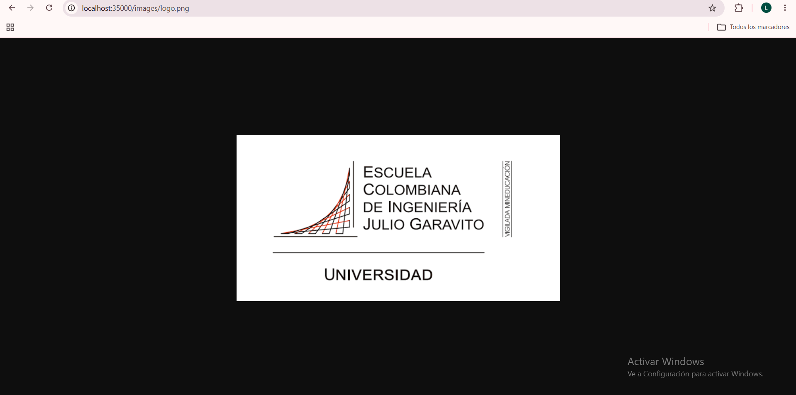
 
**Rutas dinámicas**
 
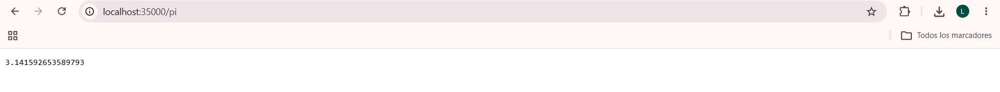
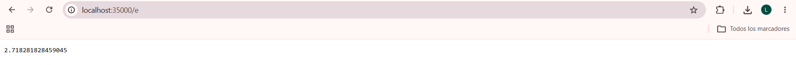
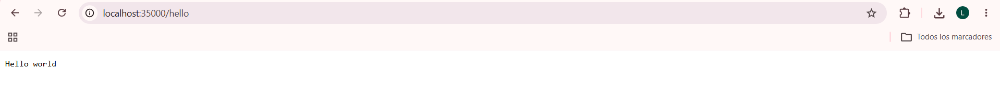
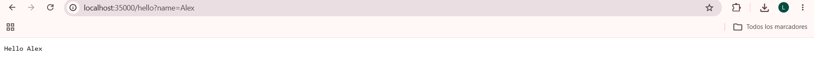

 
**Manejo de errores**
 
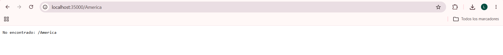
 
**Variables de entorno**
 
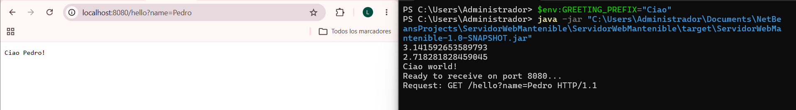
 
**Apagado controlado**
 
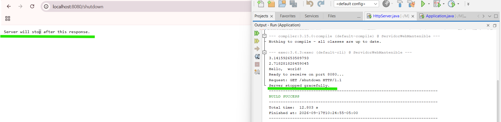
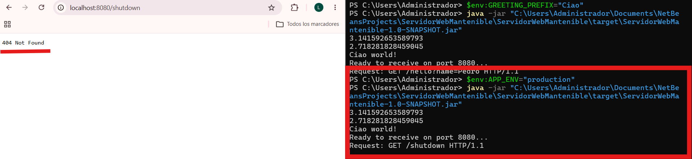
 
##### En la nube (Render)
 
**Página principal, servida en producción**
 
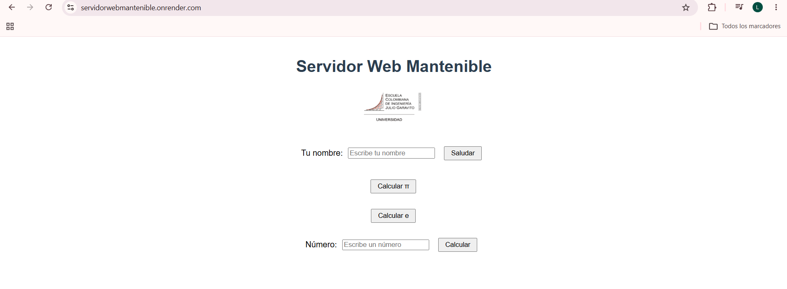
 
**Endpoint REST #1 — GET /pi en producción**
 

 
**Endpoint REST #2 — GET /hello?name=Pedro en producción**
 
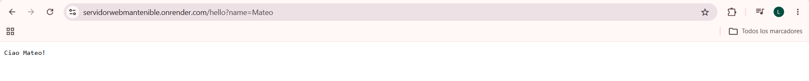
 
**Variables de entorno configuradas en Render (sin secretos)**
 
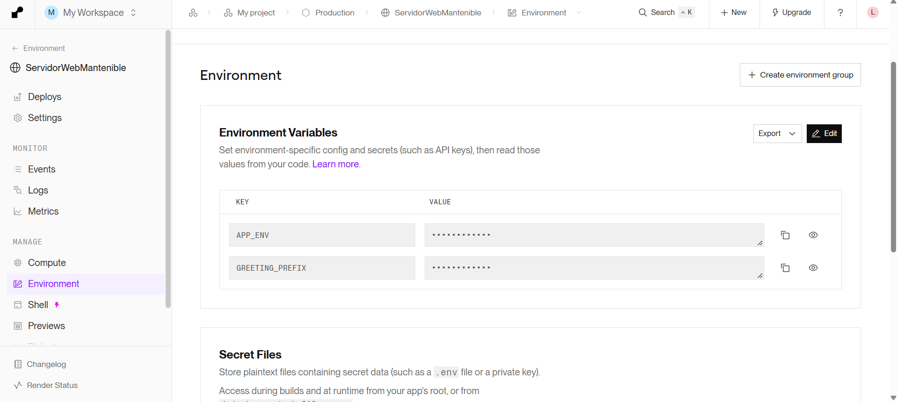
 
**GET /shutdown no disponible en producción**
 
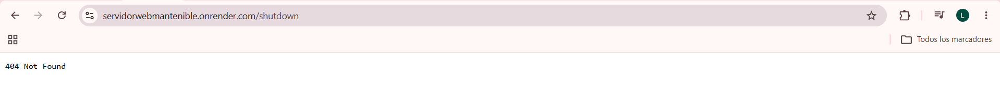

##### Por qué esta arquitectura es mantenible

### Principios de diseño

* **Separación de responsabilidades:** la infraestructura HTTP (HttpServer) está separada del comportamiento de la aplicación, definido mediante las lambdas registradas en Application. A su vez, el ruteo está a cargo de Router y la gestión de archivos estáticos de StaticFileService.

* **Modularidad:** cada componente (Router, Request, Response, StaticFileService) tiene una responsabilidad específica y está implementado en su propia clase.

* **Bajo acoplamiento:** agregar una nueva ruta requiere únicamente registrarla en Application.java, sin necesidad de modificar HttpServer, Router u otras clases del framework.

* **Extensibilidad:** se pueden agregar nuevos servicios mediante el registro de funciones, sin modificar el ciclo principal de manejo de conexiones.

* **Configuración externalizada:** el puerto, el entorno de ejecución y el prefijo de saludo se obtienen mediante variables de entorno, en lugar de estar definidos directamente en el código. Esto permite utilizar el mismo archivo .jar tanto en local como en la nube, cambiando únicamente la configuración externa.

* **Testabilidad:** cada componente, como Router, StaticFileService y el procesamiento de los query strings, puede probarse de manera aislada sin necesidad de iniciar el servidor completo.

* **Apagado seguro:** el servidor puede detenerse de forma controlada, evitando interrumpir abruptamente una petición que esté en curso. Esta capacidad se deshabilita automáticamente en producción mediante la variable APP_ENV.

#### Pruebas realizadas

**Peticiones dinámicas exitosas**

- GET /pi → 3.141592653589793
- GET /e → 2.718281828459045
- GET /hello?name=Pedro → Hello Pedro! (o el prefijo configurado en GREETING_PREFIX)
- GET /hello (sin parámetro) → Hello world!
- GET /hello?name=Pedro&language=en → confirmado que un parámetro extra no reconocido por la lambda no causa error

**Recursos estáticos**

- GET / y GET /index.html → página HTML renderizada correctamente
- GET /app.js → contenido JS servido con Content-Type: application/javascript
- GET /styles.css → contenido CSS servido con Content-Type: text/css, aplicado correctamente por el navegador
- GET /images/logo.png → imagen renderizada correctamente

**Respuesta 404**

- GET /unknown (o cualquier ruta inexistente) → 404 Not Found, con el cuerpo exacto 404 Not Found

**Manejo de errores**

- Confirmado que una excepción lanzada dentro de una lambda registrada (ej. NumberFormatException en /square?value=abc) no detiene el servidor — se captura, se registra en consola, y el servidor sigue atendiendo peticiones siguientes.

**Apagado controlado**

- GET /shutdown con APP_ENV=development (o sin definir) → responde "Server will stop after this response.", y el servidor se detiene de forma controlada inmediatamente después, dejando de aceptar nuevas conexiones.
- GET /shutdown con APP_ENV=production → responde 404 Not Found, confirmando que la ruta no existe en ese entorno.

**Variables de entorno**

- Confirmado que PORT cambia el puerto de escucha del servidor sin modificar el código.
- Confirmado que GREETING_PREFIX cambia el prefijo devuelto por /hello sin modificar el código.

### En producción (Render)

- GET / → página principal servida correctamente
- GET /pi → endpoint dinámico respondiendo en producción
- GET /hello?name=Pedro → endpoint dinámico respondiendo en producción
- GET /shutdown → 404 Not Found, confirmando que no está expuesta públicamente